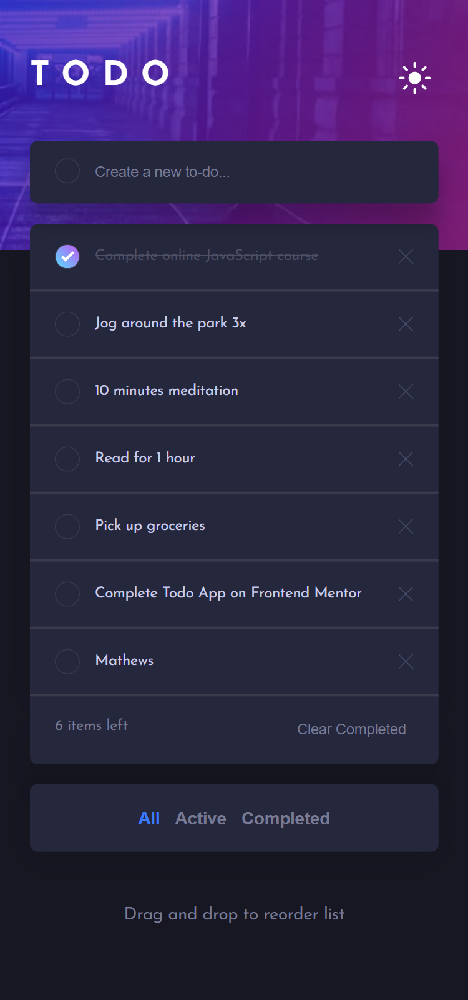

# Frontend Mentor - Todo app

Esta é uma solução para o desafio [Todo app de Frontend Mentor](https://www.frontendmentor.io/challenges/todo-app-Su1_KokOW). Os desafios do Frontend Mentor ajudam a melhorar suas habilidades de codificação através da construção de projetos realistas.

# Índice

- [Resumo](#resumo)
  - [Desafio](#desafio)
  - [Captura de tela](#captura-de-tela)
  - [Links](#links)
- [Processo](#processo)
  - [Construção](#construção)
  - [Aprendizado](#aprendizado)
- [Recursos](#recursos)
- [Autor](#autor)

<br>

# Resumo

## Desafio

<br>

Este projeto consiste em uma página de cadastro de cartão fictícia, que conta com um design responsivo e validação do formulário. Durante o preenchimento dos dados, eles são atualizados automaticamente na imagem representativa.

Os usuários devem ser capazes de:

- Preencher o formulário e ver os detalhes do cartão atualizando em tempo real;
- Receber a mensagem de erro quando o formulário é enviado, se:
  - Qualquer campo estiver vazio;
  - O número do cartão, data se validade, ou campos CVC estão no formato errado;
- Veja o layout ideal dependendo do tamanho da tela de seu dispositivo;
- Observe os estados interativos para elementos na página.

<br>

## Screenshot

### **Mobile**

<p style="text-align:center;">
    </img>
</p>

<br>

### **Desktop**

<p style="text-align:center;">
    </img>
</p>

<br>

## Links

- Site: [To-do List]();

<br>

# Processo

## Construção

<br>

- **HTML:**
  - Marcação semântica;
  - Metodologia BEM.
- **Sass/Scss:**
  - Importação e exportação de arquivos;
  - Variáveis;
  - Mixins;
  - Pseudo-elementos;
  - Pseudo-classes;
  - Box model;
  - Flexbox;
  - Gradientes;
  - Media queries.
- **JavaScript:**
  - Importação e exportação de funções;
  - Manipulação do DOM;
  - Uso do LocalStorage para armazenamento de dados;
  - Criação de novos elementos HTML dinamicamente;
  - Uso de event listeners para interatividade do usuário;
  - Uso de condicionais para verificação;
  - Criação de objetos;
  - Filtragem de tarefas de acordo com a opção selecionada pelo usuário.

<br>

## Aprendizado

<br>

***Pseudo-classe `not`***

```scss
&:not(:checked):hover {
    border: 2px solid transparent;
    background-image: linear-gradient(var(--background-to-do-list), var(--background-to-do-list)),
    radial-gradient(circle at top left, hsl(192, 100%, 67%), hsl(280, 87%, 65%));
    background-origin: border-box;
    background-clip: content-box, border-box;
    display: inline-block;
}
```

<br>

***Filtrar elementos, utilizar biblioteca externa para adicionar funcionalidade ao código***

```JavaScript
export function renderToDoList(filterOption = "all") {
  const toDo = JSON.parse(localStorage.getItem("toDoList")) || [];

  let filteredToDo = [];

  if (filterOption === "all") {
    filteredToDo = toDo;
  } else if (filterOption === "active") {
    filteredToDo = toDo.filter((task) => !task.completed);
  } else if (filterOption === "completed") {
    filteredToDo = toDo.filter((task) => task.completed);
  }

  list.innerHTML = "";

  filteredToDo.forEach((task, index) => {
    const taskItem = document.createElement("li");
    taskItem.classList.add("to-do__item");
    taskItem.classList.add("to-do__drag");
    taskItem.setAttribute("data-value", index);

    taskItem.innerHTML = `
      <input type="checkbox" class="to-do__complete" ${
        task.completed ? "checked" : ""
      }>
      <span class="to-do__task">${task.toDo}</span>
      <button type="button" class="to-do__delete">
        
      </button>`;

    list.appendChild(taskItem);
  });
}
```

```javascript
function filterTasks() {
  const allTasks = document.getElementById("filter-all");
  const activeTasks = document.getElementById("filter-active");
  const completedTasks = document.getElementById("filter-completed");

  allTasks.classList.add("active");

  allTasks.addEventListener("click", (e) => {
    e.preventDefault();

    if (
      activeTasks.classList.contains("active") ||
      completedTasks.classList.contains("active")
    ) {
      activeTasks.classList.remove("active");
      completedTasks.classList.remove("active");
      allTasks.classList.add("active");
    }

    renderToDoList("all");
  });

  activeTasks.addEventListener("click", (e) => {
    e.preventDefault();

    if (
      allTasks.classList.contains("active") ||
      completedTasks.classList.contains("active")
    ) {
      allTasks.classList.remove("active");
      completedTasks.classList.remove("active");
      activeTasks.classList.add("active");
    }

    renderToDoList("active");
  });

  completedTasks.addEventListener("click", (e) => {
    e.preventDefault();

    if (
      allTasks.classList.contains("active") ||
      activeTasks.classList.contains("active")
    ) {
      allTasks.classList.remove("active");
      activeTasks.classList.remove("active");
      completedTasks.classList.add("active");
    }

    renderToDoList("completed");
  });
}
```

```javascript

const list = document.querySelector(".sortable");

Sortable.create(list, {
  animation: 150,
  handle: ".to-do__drag",
  onEnd: () => {
    
    const taskList = Array.from(list.children).map((task, index) => {
        task.setAttribute("data-value", index);
        return {
            id: parseInt(task.getAttribute("data-value")),
            toDo: task.querySelector(".to-do__task").innerText,
            completed: task.querySelector(".to-do__complete").checked,
            order: index,
      };
    });

    localStorage.setItem("toDoList", JSON.stringify(taskList));
    renderToDoList();
  },
});

filterTasks();

```

# Recursos

- [Trabalhando com objetos](https://developer.mozilla.org/pt-BR/docs/Web/JavaScript/Guide/Working_with_Objects);
- [localStorage.getItem()](https://developer.mozilla.org/pt-BR/docs/Web/API/Storage/getItem);
- [localStorage.setItem()](https://developer.mozilla.org/pt-BR/docs/Web/API/Storage/setItem);
- [JSON.parse()](https://developer.mozilla.org/pt-BR/docs/Web/JavaScript/Reference/Global_Objects/JSON/parse);
- [JSON.stringify()](https://developer.mozilla.org/pt-BR/docs/Web/JavaScript/Reference/Global_Objects/JSON/stringify);
- [document.createElement()](https://developer.mozilla.org/pt-BR/docs/Web/API/Document/createElement);
- [element.setAttribute()](https://developer.mozilla.org/pt-BR/docs/Web/API/Element/setAttribute);
- [element.appendChild()](https://developer.mozilla.org/pt-BR/docs/Web/API/Node/appendChild);
- [Operador Ternário](https://developer.mozilla.org/pt-BR/docs/Web/JavaScript/Reference/Operators/Conditional_Operator);
- [Sortable](https://github.com/SortableJS/Sortable).

# Autor

- Site pessoal - [Mathews Mattar](https://www.linkedin.com/in/mathewsmattar/)
